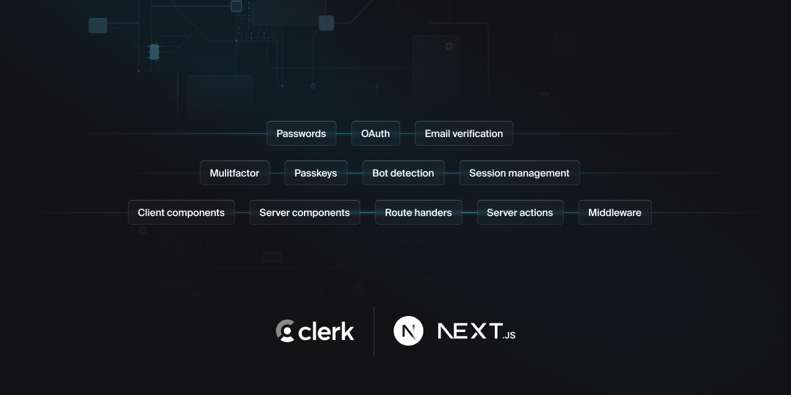

  <a href="https://go.clerk.com/e3UDpP4" target="_blank" rel="noopener noreferrer">
   <picture>
      <source media="(prefers-color-scheme: dark)" srcset="./public/light-logo.png">
      
    </picture>
  </a>
   

  <h1>
    Next.js Clerk auth starter template
  </h1>
  
  
  
   
   
  

## Introduction

Clerk authentication template.
